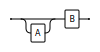

# Railroad Diagrams (or Syntax Diagrams)

Railroad diagrams are a way to visualize context-free grammars.

## How to Read

You read the diagram from left to right and from top to bottom. The diagram is a visual representation of a context-free
grammar. The diagram shows the rules of the grammar and how they are connected.

The following conventions are used:

- The following diagram shows values `A`, `B` and `C`, which must be specified. The required values are defined on the
  main line of the diagram. (_ABNF_: `and = A B C`)

- The following diagram shows the optional value `A`. The value can be bypassed by following the empty path.
  (_ABNF_: `opt = [A] B `)

- In the example below `A`, `B` and `C` are options. The value can be chosen from the options.
  (_ABNF_: `or = A / B / C`)

## Example

## References

- [Niklaus Wirth](https://www.research-collection.ethz.ch/bitstream/handle/20.500.11850/68910/eth-3059-01.pdf)
